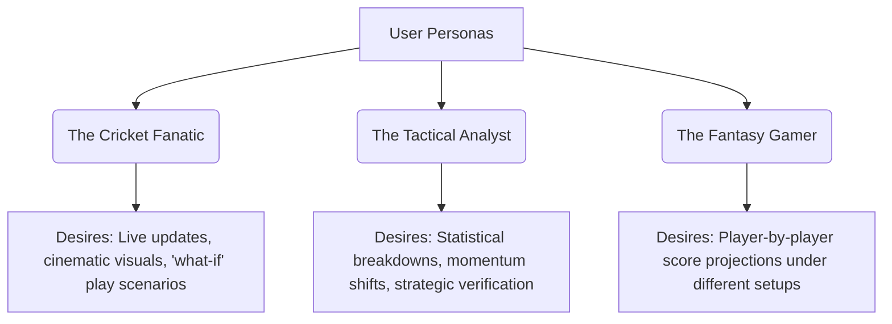
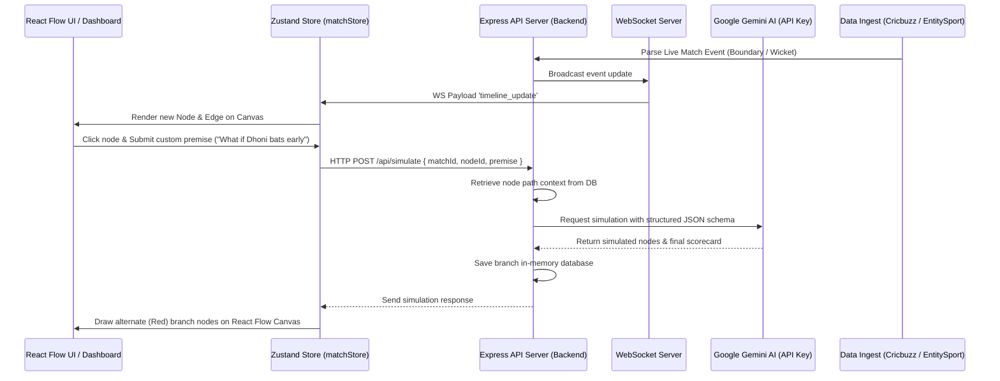

# Project Requirements Document (PRD)

## IPL Multiverse — Cricket Alternate Reality Engine

| Metadata | Details |
| :--- | :--- |
| **Document Version** | 1.0.0 |
| **Date** | May 24, 2026 |
| **Status** | Active / Comprehensive |
| **Target Audience** | Engineering, QA, Design, Product Owners |
| **Authors** | Antigravity AI |

---

## 1. Executive Summary

### 1.1 Problem Statement
Cricket fans, analysts, and gaming enthusiasts often speculate on "what if" scenarios during a live cricket match (e.g., *"What if the catch wasn't dropped?"*, *"What if they introduced a spinner early?"*, *"What if the opener went on to score a century?"*). Traditionally, sports broadcasts are static, linear, and offer no interactive, visual, or quantitative way to explore these hypothetical tactical variations and project their cascading effects on the final scorecard and win probabilities.

### 1.2 Solution Statement
**IPL Multiverse** (the *Cricket Alternate Reality Engine*) is an interactive, real-time sports visualization and simulation system. It transforms linear match data feeds into a dynamic, branching graph (a "match multiverse"). Users can select any live or completed match event node, inject custom tactical tweaks or canon premises, and instantly generate simulated alternate timelines. These timelines project subsequent play milestones, ball-by-ball commentary, scorecard stats, and win probabilities using Google Gemini AI models.

### 1.3 Key Value Proposition
- **Gamified Engagement**: Empowers fans to "play manager" and test tactical shifts in real time.
- **Cinematic Sports Analytics**: Replaces dry tables with a glowing, animated node-link graph visualizing match momentum and timeline splits.
- **Explainable AI Simulations**: Integrates LLMs (Google Gemini) not just to guess numbers, but to write professional, context-rich sports commentary and tactical reasoning explaining the "why" behind alternate projections.

---

## 2. System Objectives & Target Personas

### 2.1 System Objectives
1. **Real-time Ingestion**: Consume live cricket commentary, scores, and milestones via web scraping (Cricbuzz) or cricket API integrations (Entity Sport).
2. **Interactive Visualization**: Render the progression of a cricket match as a directed acyclic graph (DAG) where nodes represent major events (toss, powerplay, wickets, boundaries, timeout milestones) and edges reflect temporal sequence.
3. **Alternate Reality Engine**: Allow non-linear branching from any node in the graph, simulating the rest of the match under customized conditions.
4. **Explainable AI Analytics**: Leverage Gemini's reasoning capabilities to output structured JSON representing simulated outcomes, card states, and commentators' insights.
5. **Timeline Comparison**: Support side-by-side analytical comparisons of the "real" vs. "alternate" timelines to evaluate strategic deviations.

### 2.2 Target Personas



---

## 3. Product Features & Functional Requirements

### 3.1 Feature Breakdown

The application is structured around six core modules:
1. **Live Matches Dashboard**: Entry point for selecting live, upcoming, and demo matches.
2. **Interactive Match Flow Canvas**: React Flow-powered workspace rendering match event chains.
3. **Context Panel (Right Sidebar)**: Tabbed drawer displaying insights, charts, scorecards, and commentary feeds.
4. **Alternate Reality Simulator**: Floating console to inject custom scenarios.
5. **Timeline Comparison Overlay**: Analytical dashboard comparing two branches.
6. **Real-time Sync Pipeline**: WebSocket server keeping client screens in sync with live matches.

---

### 3.2 Detailed Functional Requirements

#### FR-1: Match List & Dashboard
- **Description**: Provide a landing dashboard displaying all current cricket fixtures.
- **Specifications**:
  - **Live Section**: Query active matches from the server and display them with a pulsing red "LIVE" badge.
  - **Upcoming Section**: Display matches scheduled for later, along with dates/venues.
  - **Demo Section**: Provide pre-loaded scenarios (e.g., El Clasico: MI vs CSK) that replay historical match data sequentially to demonstrate live features offline.
  - **IPL Focus**: Categorize Indian Premier League (IPL) matches prominently at the top with premium glowing gradients.

#### FR-2: Interactive Match Flow Canvas (React Flow)
- **Description**: Render a visual representation of match progress as node pathways.
- **Specifications**:
  - **Innings Lanes**: Display Innings 1 and Innings 2 in separate visual background tracks to signify match phases clearly (e.g., Emerald track for Innings 1, Sky Blue track for Innings 2).
  - **Node Types**: Implement specialized nodes:
    - `toss`: Displays the winner and match decision.
    - `over`: Shows milestone overs (e.g., end of powerplay, over 10, over 15).
    - `wicket`: High-impact red-accented nodes detailing the dismissed batsman and bowling team shift.
    - `boundary`: Highlighted nodes representing 4s and 6s.
    - `milestone`: Milestones like half-centuries, centuries, or team score marks.
  - **Color Coding**: 
    - **Green Paths**: Represent the "Canon" timeline (the actual events of the match).
    - **Red/Rose Paths**: Represent "Alternate" timelines created by user simulations.
  - **Interactivity**: Clicking any node highlights it and triggers the right sidebar to load the match state up to that point. Alternate timeline nodes can be dragged by users to arrange the canvas view as desired.

#### FR-3: Alternate Reality Simulator (Simulation Panel)
- **Description**: Trigger alternate projections from a user-selected match state.
- **Specifications**:
  - **Branch Trigger**: Users can select any node and open the simulation panel.
  - **Premise Ingestion**: Accept custom free-text user premises (e.g., *"Bumrah bowled the 18th over instead of Pandya"* or *"Dhoni bats at number 4"*).
  - **Context Collection**: Gather the full list of ancestor nodes leading from the toss to the selected node to supply historical context to the AI simulator.
  - **State Generation**: Send selected node stats + parent path context + custom premise to the backend for processing.

#### FR-4: AI Simulation Engine (Gemini Service)
- **Description**: Back-end engine simulating outcomes based on context and user constraints.
- **Specifications**:
  - **Integration**: Leverage the official `@google/genai` client, utilizing the `gemini-2.5-flash` model.
  - **Structured JSON Schema**: Enforce structural JSON mode response containing:
    - `projectedResult`: Summarized outcome string.
    - `simulatedNodes`: Array of new event nodes with labels, tactical commentary, win probabilities, and momentum numbers.
    - `finalScorecard`: Updated scorecard object containing player batting and bowling lines.
  - **Math Integrity**: Projections must keep scoring metrics incremental (e.g., runs and wickets cannot decrement from the branch point, and targets must align in Innings 2).
  - **Mock Fallback**: If no Gemini API key is configured or the rate limit is exceeded, serve pre-defined realistic simulated branches based on matches (e.g., Opener Century, Powerplay Disasters) to maintain app functionality.

#### FR-5: Context Panel (Right Sidebar)
- **Description**: An interactive sidebar display linked to the clicked node.
- **Specifications**:
  - **Tab 1 — Match Insight**: Display an AI-generated tactical summary of the selected event block, highlights of key player involvement, and the cumulative win probability.
  - **Tab 2 — Analytics**: Render a dynamic momentum meter (values from -100 to +100), win probability sliders, and analytics charts.
  - **Tab 3 — Scorecard**: Display a fully populated Cricbuzz-style scorecard representing player details (runs, balls, fours, sixes, strike rate, dismissal info, overs, maidens, runs conceded, wickets, economy rates) at the moment of the selected event node.
  - **Tab 4 — Live Feed**: Show a chronological feed of ball-by-ball commentary (actual or AI-generated).

#### FR-6: Timeline Comparison Overlay
- **Description**: Side-by-side visual comparison dashboard.
- **Specifications**:
  - **Trigger**: Click "Compare Timeline" on any alternate branch.
  - **Metrics Dashboard**: Display a comparative grid highlighting:
    - **Final Projected Score** (Real vs. Simulated)
    - **Projected Win Probability**
    - **Wickets Lost**
    - **Innings Run Rate & Death Over Acceleration**
  - **Explanations**: Display AI-synthesized comparative reasoning detailing *why* the tactical tweak shifted the final scores and probabilities.

#### FR-7: Real-time Ingestion & WebSocket Pipeline
- **Description**: WebSocket broadcasting service supporting real-time live match updates.
- **Specifications**:
  - **Subscription System**: Clients connect and send a `subscribe` message with a specific `matchId`.
  - **Poller/Playback Loop**: The server polls external data streams (Cricbuzz/Entity Sport API) or plays mock database frames every few seconds.
  - **Commentary Streaming**: As new events occur (wickets, milestones, boundaries), the server formats them into `CricketEventNode` structures and broadcasts a `timeline_update` event.
  - **Dynamic Appending**: The frontend Zustand store listens to WebSockets and appends new nodes to the React Flow canvas on the fly if the active branch is set to the live "Real Match" timeline.

---

## 4. Technical Architecture & Tech Stack

### 4.1 Tech Stack

The workspace is structured as a TypeScript-focused monorepo using npm workspaces:

```
├── package.json (root workspace)
├── tsconfig.base.json
├── shared/
│   ├── package.json
│   ├── tsconfig.json
│   └── src/
│       ├── index.ts
│       └── types.ts
├── backend/
│   ├── package.json
│   ├── tsconfig.json
│   ├── .env.example
│   └── src/
│       ├── index.ts
│       ├── services/
│       │   ├── liveCricket.ts
│       │   └── geminiSimulator.ts
│       └── data/
│           └── mockMatch.json
└── frontend/
    ├── package.json
    ├── next.config.ts
    ├── postcss.config.mjs
    ├── tailwind.config.ts
    └── src/
        ├── app/
        │   ├── layout.tsx
        │   ├── page.tsx (Dashboard)
        │   └── match/[id]/
        │       └── page.tsx (Workspace Canvas)
        ├── components/
        │   ├── CricketNode.tsx
        │   ├── Navbar.tsx
        │   ├── RightSidebar.tsx
        │   ├── SimulationPanel.tsx
        │   └── ComparisonOverlay.tsx
        └── store/
            └── matchStore.ts
```

| Layer | Technology | Key Package Dependencies |
| :--- | :--- | :--- |
| **Core Monorepo** | Node.js, TypeScript | npm Workspaces, `tsconfig.base.json` |
| **Frontend Framework** | Next.js (v16 App Router), React (v19) | `next`, `react`, `react-dom` |
| **State Management** | Zustand (v5) | `zustand` |
| **Graph Visualization** | React Flow (v12) | `@xyflow/react` |
| **UI Aesthetics & Icons**| CSS, Tailwind CSS (v4), Lucide Icons | `tailwindcss`, `lucide-react` |
| **Animations** | Framer Motion | `framer-motion` |
| **Analytics Charts** | Recharts | `recharts` |
| **Backend Server** | Node.js, Express, WebSockets | `express`, `ws`, `cors` |
| **Execution Tooling** | TSX, TypeScript | `tsx`, `typescript` |
| **AI Integration** | Google Gen AI SDK | `@google/genai` (v2.5+ specs) |

---

### 4.2 High-Level Architecture & Data Flow



---

## 5. Shared Data Schemas

Common domain models are defined in `@cricket-multiverse/shared/src/types.ts` and imported by both the frontend and backend.

### 5.1 Match Interface
Defines high-level information about the fixture:
```typescript
export type MatchStatus = 'live' | 'mock' | 'completed' | 'upcoming';

export interface TeamInfo {
  name: string;
  shortName: string;
  logoUrl?: string;
}

export interface Match {
  id: string;
  teamA: TeamInfo;
  teamB: TeamInfo;
  status: MatchStatus;
  currentInnings: 1 | 2;
  venue: string;
  date: string;
  tossWinner: string;
  tossDecision: 'bat' | 'field';
  series?: string;
}
```

### 5.2 Cricket Event Node Interface
Represents a single decision node in the timeline graph:
```typescript
export type EventNodeType =
  | 'toss'
  | 'over'
  | 'wicket'
  | 'boundary'
  | 'timeout'
  | 'milestone'
  | 'simulation_start'
  | 'simulation_node';

export interface WinProbability {
  teamA: number; // e.g., 0.45 (45%)
  teamB: number; // e.g., 0.55 (55%)
  [key: string]: number; // index signature for shortname access
}

export interface CricketEventNode {
  id: string;
  type: EventNodeType;
  label: string;
  description: string;
  overNumber: number; // e.g., 6.0 (complete), 6.4 (mid-over)
  runs: number;
  wickets: number;
  team: string; // batting team shortName (e.g., "MI")
  timestamp: string;
  winProbability: WinProbability;
  momentum: number; // range -100 to 100
  commentary: string;
  isAlternate: boolean;
  branchId: string; // "real" or generated UUID
  parentId?: string; // parent event link
}
```

### 5.3 Timeline Branch Interface
Tracks alternate universes:
```typescript
export interface TimelineBranch {
  id: string; // "real" or unique UUID (e.g. branch_1716584281000)
  name: string; // truncated premise or customized name
  parentBranchId?: string; // pointer to source branch
  parentEventNodeId?: string; // pointer to source node
  premise: string; // full tactical tweak text
  createdAt: string;
  projectedResult?: string; // Projected summary, e.g. "MI wins by 12 runs"
}
```

### 5.4 Scorecard State Interface
Tracks inning cards at any point in history:
```typescript
export interface PlayerScorecardEntry {
  name: string;
  runs: number;
  balls: number;
  fours: number;
  sixes: number;
  strikeRate: number;
  isOut: boolean;
  dismissalInfo?: string;
}

export interface BowlerScorecardEntry {
  name: string;
  overs: number;
  maidens: number;
  runs: number;
  wickets: number;
  economy: number;
}

export interface Scorecard {
  batting: PlayerScorecardEntry[];
  bowling: BowlerScorecardEntry[];
  extras: number;
  totalRuns: number;
  totalWickets: number;
  overs: number;
  target?: number;
}

export interface MatchScorecardState {
  matchId: string;
  branchId: string;
  teamA: Scorecard;
  teamB: Scorecard;
}
```

---

## 6. API Endpoints & WebSocket Protocol

### 6.1 HTTP REST Endpoints

#### 1. Fetch Matches List
- **Endpoint**: `GET /api/matches`
- **Description**: Returns all live, upcoming, completed, and mock fixtures.
- **Response**: `Match[]`

#### 2. Fetch Match Timeline
- **Endpoint**: `GET /api/matches/:id/timeline?branchId=:branchId`
- **Description**: Returns the timeline details filtered down to the requested branch pathway.
- **Response**: 
  ```json
  {
    "match": { ... },
    "branches": [ ... ],
    "nodes": [ ... ],
    "activeBranchId": "real",
    "scorecardState": { ... }
  }
  ```

#### 3. Reset Match Timeline
- **Endpoint**: `POST /api/matches/:id/reset`
- **Description**: Clears all alternate branches and resets live playback to initial state (toss).
- **Response**: `{ "message": "Match ipl_2026_mi_csk reset and live playback restarted." }`

#### 4. Run Simulation
- **Endpoint**: `POST /api/simulate`
- **Description**: Triggers a Gemini timeline projection based on current state and user parameters.
- **Request Body**:
  ```json
  {
    "matchId": "ipl_2026_mi_csk",
    "nodeId": "node_toss",
    "premise": "Openers hit a fast century in powerplay"
  }
  ```
- **Response**:
  ```json
  {
    "branch": { ... },
    "nodes": [ ... ],
    "scorecardState": { ... }
  }
  ```

---

### 6.2 WebSocket Server Communication

- **URL**: `ws://localhost:4000`
- **Protocol**: Single socket upgrades with JSON message frame payloads.

#### Message Outbound (Client to Server)
To subscribe to real-time events for a match:
```json
{
  "type": "subscribe",
  "matchId": "ipl_2026_mi_csk"
}
```

#### Message Inbound (Server to Client)
1. **Initialize State** (`init`): Fired immediately upon subscribing to load existing events.
2. **Timeline Update** (`timeline_update`): Broadcasted when a new live event is parsed.
3. **Scorecard Update** (`scorecard_update`): Fired when player statistics change without a new graph node.
4. **Match Complete** (`match_completed`): Signals match status transitioned to `completed`.

---

## 7. UX & Visual Design System Requirements

To ensure a cinematic and premium user experience:
1. **Curated Dark Theme**: Deep black (`#09090b` / `zinc-950`) and dark grey gradients to represent high-tech dashboard hubs. Avoid pure primary colors in UI blocks; use Tailwind zinc and slate ranges.
2. **Glassmorphism Panels**: UI dialogs, panels, and cards should leverage semi-transparent background backdrops (`backdrop-blur-md bg-zinc-950/40 border-zinc-900`) to overlay the visual flow canvas smoothly.
3. **Fluid Micro-Animations**: Hover animations on match cards, glowing interactive selections, pulsing active nodes, and animated edge lines (`animated: true` on React Flow SVGs) to visualize momentum direction.
4. **Glow Effects**: Drop shadows on active elements using high-contrast colors (emerald-500/50 for real-time play, rose-500/50 for multiverse splits).
5. **No Placeholders**: Standard UI icons and graphics must use professional SVGs/icons (`lucide-react`) to project production-ready aesthetics.

---

## 8. Non-Functional Requirements (NFRs)

### 8.1 Performance
- **Client Render Speed**: The React Flow canvas must easily render up to 100+ nodes and corresponding connection lines without lagging or frame-rate drops.
- **AI Simulation Latency**: Projections from Gemini should process and return under 4 seconds. Visual loading states (glowing spinner overlays) must occupy the sidebar and simulation console to preserve responsiveness.
- **WebSocket Throughput**: Connection updates must propagate in under 200ms to preserve real-time synchronicity.

### 8.2 Reliability & Error Resilience
- **LLM Failure Resilience**: The simulator service must wrap LLM invocations in try-catch-finally statements. If API request timeouts or rate-limiting occur, the system must transparently fall back to generating logical mock projections so user dashboards remain interactive.
- **Monorepo Modularity**: Shared modules must strictly separate TS configurations from build execution targets, preventing circular dependency paths between Next.js and Express.

### 8.3 Security
- **API Secret Obfuscation**: The Google Gemini API key must be stored in server-side environment variables (`backend/.env`) and never exposed to client browsers.

---

## 9. Future Product Roadmap

The following specifications are planned for subsequent iterations:
- **Shareable Timelines**: Allow users to export and share unique multiverse branch links via Twitter/WhatsApp.
- **Multiplayer Collaboration**: Enable multiple fans to join a single match canvas session, chatting and voting on tactical branch proposals.
- **Visual Heatmaps**: Project bowling pitches and batting zones based on the selected graph node context.
- **Voice Playback**: Integrate Text-to-Speech voices to dictate AI commentary in professional commentators' voices (e.g. Harsha Bhogle style).
